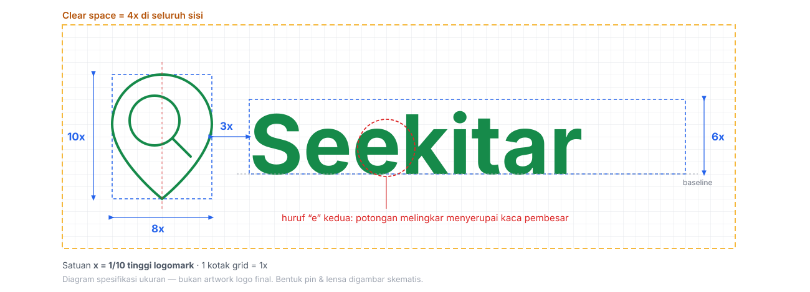

# 🎨 BRAND GUIDELINE — SEEKITAR

**Dokumen Identitas & Panduan Merek**  
**Versi 2.0 — Komprehensif & Siap Implementasi**

| Informasi Dokumen    |                                                                                                           |
| :------------------- | :-------------------------------------------------------------------------------------------------------- |
| **Nama Merek**       | Seekitar                                                                                                  |
| **Tagline**          | _Yang kamu butuhkan, ada di sekitar._                                                                     |
| **Kategori**         | Platform Marketplace Hyperlocal Dua Arah                                                                  |
| **Pemilik Merek**    | PT Seekitar Digital Nusantara                                                                             |
| **Tanggal Efektif**  | 27 Juli s2026                                                                                             |
| **Versi Dokumen**    | 2.0                                                                                                       |
| **Penanggung Jawab** | Tim Brand & Kreatif                                                                                       |
| **Sifat Dokumen**    | **Rahasia Internal** – hanya untuk pihak yang terlibat langsung dalam produksi komunikasi merek Seekitar. |

---

## DAFTAR ISI

1. [Strategi & Fondasi Merek](#1-strategi--fondasi-merek)  
   1.1 [Visi & Misi Merek](#11-visi--misi-merek)  
   1.2 [Janji Merek (Brand Promise)](#12-janji-merek-brand-promise)  
   1.3 [Esensi Merek (Brand Essence)](#13-esensi-merek-brand-essence)  
   1.4 [Arketipe Merek](#14-arketipe-merek)  
   1.5 [Proposisi Nilai Unik (UVP)](#15-proposisi-nilai-unik-uvp)  
   1.6 [Target Audiens Primer & Sekunder](#16-target-audiens-primer--sekunder)
2. [Identitas Verbal](#2-identitas-verbal)  
   2.1 [Kisah Nama “Seekitar”](#21-kisah-nama-seekitar)  
   2.2 [Arsitektur Penamaan](#22-arsitektur-penamaan)  
   2.3 [Tagline & Pesan Kunci](#23-tagline--pesan-kunci)  
   2.4 [Nada Suara Merek (Tone of Voice)](#24-nada-suara-merek-tone-of-voice)  
   2.5 [Panduan Gaya Penulisan (Copywriting)](#25-panduan-gaya-penulisan-copywriting)  
   2.6 [Kamus Bahasa Merek](#26-kamus-bahasa-merek)
3. [Identitas Visual](#3-identitas-visual)  
   3.1 [Logo Utama](#31-logo-utama)  
   3.2 [Konstruksi & Grid Logo](#32-konstruksi--grid-logo)  
   3.3 [Variasi Logo & Aturan Penggunaan](#33-variasi-logo--aturan-penggunaan)  
   3.4 [Area Aman & Ukuran Minimum](#34-area-aman--ukuran-minimum)  
   3.5 [Palet Warna](#35-palet-warna)  
   3.6 [Tipografi](#36-tipografi)  
   3.7 [Ikonografi](#37-ikonografi)  
   3.8 [Ilustrasi & Fotografi](#38-ilustrasi--fotografi)  
   3.9 [Motion & Animasi](#39-motion--animasi)
4. [Sistem Kepercayaan & Badge](#4-sistem-kepercayaan--badge)  
   4.1 [Level Verifikasi](#41-level-verifikasi)  
   4.2 [Badge Toko & Transaksi](#42-badge-toko--transaksi)  
   4.3 [Aturan Penempatan & Integritas](#43-aturan-penempatan--integritas)
5. [Aplikasi Merek (Brand Application)](#5-aplikasi-merek-brand-application)  
   5.1 [Aplikasi Seluler & Web](#51-aplikasi-seluler--web)  
   5.2 [Media Sosial](#52-media-sosial)  
   5.3 [Materi Cetak & Merchandise](#53-materi-cetak--merchandise)  
   5.4 [Stationery & Dokumen Resmi](#54-stationery--dokumen-resmi)  
   5.5 [Event & Pameran](#55-event--pameran)  
   5.6 [Kemitraan & Co-Branding](#56-kemitraan--co-branding)
6. [Panduan Komunikasi Pemasaran](#6-panduan-komunikasi-pemasaran)  
   6.1 [Format Iklan Digital](#61-format-iklan-digital)  
   6.2 [Email & Notifikasi](#62-email--notifikasi)  
   6.3 [Landing Page & Web](#63-landing-page--web)
7. [Aturan & Larangan (Do’s & Don’ts)](#7-aturan--larangan-dos--donts)
8. [Kerangka Hukum & Kepatuhan](#8-kerangka-hukum--kepatuhan)
9. [Lampiran](#9-lampiran)

---

## 1. STRATEGI & FONDASI MEREK

### 1.1 Visi & Misi Merek

**Visi**  
Menjadi nadi ekonomi sirkular tingkat kabupaten yang menghubungkan setiap kebutuhan harian warga dengan pelaku usaha terdekat, membangun kemandirian dan kesejahteraan lokal.

**Misi**

1. Menyediakan platform digital paling lengkap dan tepercaya untuk pencarian barang, jasa, dan sewa dalam radius satu kabupaten.
2. Memberdayakan UMKM dan penyedia jasa informal agar dapat menjemput permintaan, bukan hanya menunggu pelanggan.
3. Membangun ekosistem transaksi lokal yang transparan, aman, dan penuh keakraban.

### 1.2 Janji Merek (Brand Promise)

_“Cukup buka Seekitar, cari atau pasang kebutuhan, dan warga serta pelaku usaha di sekitarmu siap membantu. Lebih cepat, lebih dekat, lebih terpercaya.”_

Janji ini menekankan **kemudahan**, **kecepatan reaksi lokal**, dan **kepercayaan** yang dibangun oleh sistem verifikasi dan ulasan nyata.

### 1.3 Esensi Merek (Brand Essence)

**“Lingkar Kebaikan Sekitar”**  
Seekitar bukan hanya aplikasi, melainkan gerakan ekonomi berputar di tingkat komunitas. Setiap transaksi adalah dukungan langsung kepada tetangga dan pelaku usaha mandiri.

### 1.4 Arketipe Merek

**Campuran “The Caregiver” & “The Guide”**

- **Caregiver:** Seekitar hadir untuk membantu, melindungi (melalui verifikasi), dan memastikan kesejahteraan komunitas.
- **Guide:** Seekitar menjadi pemandu andal yang tahu persis di mana kebutuhan dapat terpenuhi, membimbing pengguna dari kebingungan menuju solusi.

### 1.5 Proposisi Nilai Unik (UVP)

| Dimensi         | Nilai Seekitar                                                                                                           |
| :-------------- | :----------------------------------------------------------------------------------------------------------------------- |
| **Kedekatan**   | Hanya menampilkan penjual/penyedia yang benar-benar berada di kabupaten dan radius layanan pengguna.                     |
| **Kelengkapan** | Bukan sekadar barang; jasa profesional, jasa informal, sewa alat, hasil tani, sampai barang bekas ada dalam satu tempat. |
| **Dua Arah**    | Pembeli dapat _mencari_, dan juga _memasang kebutuhan_ yang dijawab langsung oleh penyedia lokal.                        |
| **Kepercayaan** | Verifikasi bertingkat, ulasan hanya setelah transaksi nyata, dan mekanisme laporan yang responsif.                       |

### 1.6 Target Audiens Primer & Sekunder

| Audiens                                 | Siapa Mereka                                                                                      | Kebutuhan Utama                                                                                 | Saluran                                                  |
| :-------------------------------------- | :------------------------------------------------------------------------------------------------ | :---------------------------------------------------------------------------------------------- | :------------------------------------------------------- |
| **Warga Aktif (Pembeli/Pengguna Jasa)** | 25–50 tahun, tinggal di kabupaten, menggunakan smartphone, aktif di grup komunitas WhatsApp.      | Mencari barang/jasa spesifik dengan cepat, membandingkan harga lokal, percaya pada rekomendasi. | Mobile app, Facebook/Instagram lokal, rekomendasi mulut. |
| **UMKM & Toko Kelontong**               | Pemilik warung, toko sembako, toko material kecil. Ingin memperluas jangkauan tanpa ongkir mahal. | Menampilkan katalog, menerima pesanan sekitar, meningkatkan omset.                              | Mobile app (antarmuka sederhana), onboarding langsung.   |
| **Penyedia Jasa Mandiri**               | Tukang, teknisi, penjahit, penyewa alat, tenaga harian. Jam kerja fleksibel.                      | Mendapatkan permintaan kerja harian di dekat lokasi.                                            | Notifikasi push, WhatsApp, app.                          |
| **Pemerintah Daerah & Komunitas**       | Dinas Koperasi/UMKM, pemerintahan kecamatan.                                                      | Mendorong digitalisasi UMKM, memetakan aktivitas ekonomi lokal.                                 | Presentasi, laporan dampak, dashboard data.              |

---

## 2. IDENTITAS VERBAL

### 2.1 Kisah Nama “Seekitar”

Nama **SEEKITAR** adalah gabungan cerdas dua kata yang menangkap perilaku inti pengguna dan batasan geografis platform:

- **SEEK** _(bahasa Inggris)_ — mencari, berusaha menemukan, menggali.
- **SEKITAR** _(bahasa Indonesia)_ — area di dekat, lingkungan terdekat.

> **SEEK + SEKITAR = SEEKITAR**

**Filosofi Berlapis:**

- **Lapisan Perilaku:** “Seek” adalah kata kerja utama — pengguna mencari barang, jasa, atau mengajukan kebutuhan.
- **Lapisan Ruang:** “Sekitar” adalah bingkai geografis — segala sesuatu terjadi dalam radius satu kabupaten.
- **Lapisan Emosi:** “Sekitar” membangkitkan rasa komunitas, ketetanggaan, dan saling kenal. Bukan transaksi dingin, melainkan ekonomi kerukunan.

**Momen “Aha”** — Ketika seseorang pertama kali mendengar atau membaca “Seekitar”, ia akan menyadari permainan katanya. Momen ini menciptakan daya ingat yang kuat dan asosiasi positif.

### 2.2 Arsitektur Penamaan

**Nama Korporat:** Seekitar  
**Deskripsi Resmi:** Pasar Digital Kabupaten

**Edisi Lokal (Kabupaten):**

```
Seekitar [Nama Kabupaten]
Contoh: Seekitar Banyumas, Seekitar Jember
```

Setiap edisi lokal menggunakan sistem warna, logo, dan identitas yang sama, dengan penyesuaian nama kabupaten pada materi promosi.

**Nama Fitur (UI) yang Wajib Digunakan:**
| Fungsi Teknis | Nama Tampil |
| :--- | :--- |
| Marketplace katalog | **Jelajahi** |
| Reverse marketplace – pembeli | **Pasang Kebutuhan** |
| Reverse marketplace – penyedia | **Kebutuhan Sekitar** |
| Buka toko/daftar sebagai penyedia | **Jual/Tawarkan** |
| Halaman toko | **Lapak** |
| Status langganan | **Gratis**, **Aktif**, **Ramai** |
| Notifikasi | **Kabar Sekitar** |
| Program loyalitas | **Warga Seekitar** |

**Tiga Aksi Utama yang Selalu Muncul di Materi Promosi:**

> **Cari → Pasang Kebutuhan → Tawarkan**

### 2.3 Tagline & Pesan Kunci

**Tagline Utama (Headline Merek):**

> ## _“Yang kamu butuhkan, ada di sekitar.”_

**Tagline Pendukung (Sub-headline situasional):**
| Konteks | Tagline |
| :--- | :--- |
| Awareness umum | _Yang dekat dulu._ |
| Fitur reverse marketplace | _Nggak ketemu? Pasang aja kebutuhanmu._ |
| Efisiensi & kecepatan | _Cari dekat, dapat cepat._ |
| Emosional/komunitas | _Dari sekitar, untuk kebutuhanmu._ |

**Pesan Kunci (Key Messages) per Audiens:**

- **Pembeli:** “Butuh barang atau jasa apa pun? Buka Seekitar. Temukan yang terdekat, atau pasang kebutuhanmu dan biarkan penyedia lokal yang menghubungimu.”
- **Penjual Barang:** “Jangkau lebih banyak pembeli di sekitarmu tanpa biaya kirim mahal. Pasang barangmu di Lapak Seekitar.”
- **Penyedia Jasa:** “Jangan menunggu orderan datang. Lihat siapa yang butuh keahlianmu hari ini dan kirim penawaran langsung.”
- **Pemerintah/Komunitas:** “Seekitar mendigitalisasi ekosistem ekonomi kabupaten secara inklusif, dari warung kelontong hingga tukang servis.”

### 2.4 Nada Suara Merek (Tone of Voice)

Persona merek Seekitar berbicara seperti **“tetangga yang selalu tahu solusi”**— ramah, ringan, informatif, dan tidak menggurui.

**Empat Pilar Tone of Voice:**

1. **Akrab & Membumi** — Gunakan kata ganti “kamu”, “aku” (untuk brand), atau “kita”. Hindari bahasa korporat.
2. **Singkat & Padat** — Kalimat pendek, langsung ke poin. Cocok untuk layar kecil.
3. **Membangun Kepercayaan** — Selalu jujur tentang proses, jangan janji berlebihan. “Kebutuhanmu sudah dikirim ke 7 penyedia terdekat.”
4. **Positif & Memberdayakan** — Soroti potensi lokal, bukan keluhan. “Warga di dekatmu mencari jasamu. Yuk, kirim penawaran.”

**Contoh Penerapan:**
| Situasi | ✅ Nada Seekitar | ❌ Hindari |
| :--- | :--- | :--- |
| Onboarding | “Halo, selamat datang! Kita cari kebutuhanmu di sekitar, yuk.” | “Selamat bergabung di platform hyperlocal marketplace kami.” |
| Pencarian kosong | “Wah, belum ada yang jual nih di dekatmu. Coba perluas radius, atau pasang kebutuhan aja.” | “0 results found. Please refine your search parameters.” |
| Promosi | “Lapakmu bisa makin ramai. Naikkan ke halaman utama kecamatan cuma Rp9.900.” | “Paket Boost Listing kini tersedia. Klik untuk informasi lebih lanjut.” |

### 2.5 Panduan Gaya Penulisan (Copywriting)

**Prinsip Dasar:**

- Gunakan kalimat aktif. “Penjual akan mengirim barang” lebih baik daripada “Barang akan dikirim oleh penjual”.
- Satu ide per kalimat.
- Maksimal 3 baris untuk paragraf di UI.
- Angka di bawah 10 ditulis huruf (“tiga penyedia”) kecuali harga, jarak, atau data.
- Harga selalu format: Rp150.000 (tanpa desimal, titik sebagai pemisah ribuan).
- Jarak gunakan “km” (lowercase, tanpa titik).

**Kata-Kata Wajib dan Larangan:**
| ✅ Wajib | ❌ Larangan |
| :--- | :--- |
| Cari | Searching |
| Pasang Kebutuhan | Submit request / Lead generation |
| Penawaran | Bid / Bidding |
| Lapak | Store / Outlet |
| Terverifikasi | Verified account |
| COD (singkatan umum) | Cash on delivery (tulis lengkap) |
| Ambil di tempat | Self-pickup |
| Diantar penjual | Seller delivery |

### 2.6 Kamus Bahasa Merek

| Istilah               | Definisi                                                              |
| :-------------------- | :-------------------------------------------------------------------- |
| **Warga Seekitar**    | Komunitas pengguna aktif, baik pembeli maupun penjual.                |
| **Lapak**             | Halaman profil usaha milik penjual/penyedia jasa.                     |
| **Pasang Kebutuhan**  | Fitur bagi pembeli untuk mengajukan permintaan barang/jasa spesifik.  |
| **Kebutuhan Sekitar** | Menu pada aplikasi penyedia untuk melihat daftar permintaan terdekat. |
| **Penawaran**         | Respons harga yang dikirim penyedia ke pembeli atas suatu kebutuhan.  |
| **Kabar Sekitar**     | Pusat notifikasi dan informasi (pesan dari sistem, promo, tips).      |
| **Terverifikasi**     | Status akun yang telah melewati pemeriksaan KTP/usaha.                |
| **Jelajahi**          | Halaman utama pencarian katalog barang, jasa, dan sewa.               |

---

## 3. IDENTITAS VISUAL

### 3.1 Logo Utama

Logo **Seekitar** adalah kombinasi **logomark (ikon)** dan **wordmark (tulisan)** yang tidak terpisahkan kecuali pada penggunaan tertentu (app icon, favicon).

**Elemen Logomark:**

- **Pin Lokasi** → melambangkan hyperlocal, kedekatan geografis.
- **Kaca Pembesar** → melambangkan “seek”, pencarian aktif.  
  Kedua elemen menyatu dalam bentuk sederhana.  
  _Catatan:_ Dua huruf “e” pada wordmark juga berperan sebagai elemen ikonik opsional (e ganda sebagai “dua pin” atau “mata yang melihat sekitar”).

**Deskripsi Detail:**

- Logomark terletak di kiri wordmark.
- Wordmark menggunakan font khusus (custom lettering berbasis Plus Jakarta Sans yang dimodifikasi) dengan spasi yang nyaman.
- Huruf “e” kedua pada “Seekitar” memiliki potongan kecil melingkar menyerupai kaca pembesar.

**Referensi visual:** lihat [diagram konstruksi](assets/brand/logo-grid-construction.svg)
di §3.2 — di sana proporsi tiap elemen dan posisi potongan pada huruf “e” kedua
ditandai secara terukur. Deskripsi tekstual saja terbukti menghasilkan
interpretasi berbeda-beda antar desainer.

### 3.2 Konstruksi & Grid Logo

Untuk menjaga konsistensi saat reproduksi, logo dibangun berdasarkan grid persegi dengan satuan **x** = 1/10 tinggi logomark.

- **Tinggi logomark:** 10x
- **Lebar logomark:** 8x
- **Jarak logomark ke wordmark:** 3x
- **Tinggi wordmark:** 6x (dari baseline ke puncak huruf besar)
- **Clear space minimum:** 4x di sekeliling seluruh logo.

**Diagram konstruksi:**



> 📐 Berkas: [`assets/brand/logo-grid-construction.svg`](assets/brand/logo-grid-construction.svg)
>
> ⚠️ Diagram ini adalah **spesifikasi ukuran**, bukan artwork logo final. Bentuk
> pin dan kaca pembesar digambar skematis agar proporsi 10x/8x/3x/6x terlihat
> jelas. Artwork final (kurva presisi, custom lettering pada huruf “e” kedua)
> dikerjakan desainer di Illustrator dan disimpan sebagai `logo-primary.ai`
> / `.svg` — lihat §9 Lampiran.

Setiap kali logo direproduksi, cocokkan dengan diagram di atas: rasio yang
melenceng akan langsung terlihat saat logo disandingkan dengan materi lama.

### 3.3 Variasi Logo & Aturan Penggunaan

| Varian                 | Elemen                                                   | Penggunaan                                                  |
| :--------------------- | :------------------------------------------------------- | :---------------------------------------------------------- |
| **Primary Full Color** | Logomark + Wordmark, Hijau `#168A4A`                     | Semua materi utama, header aplikasi, website, media sosial. |
| **Horizontal Lockup**  | Logomark di kiri, wordmark di kanan (sejajar horizontal) | Header website, kop surat.                                  |
| **Logomark Only**      | Hanya ikon pin+lensa                                     | App icon (iOS/Android), favicon, avatar profil resmi.       |
| **Monochrome Black**   | Logo hitam penuh `#1F2933`                               | Fotokopi hitam putih, stempel, media cetak satu warna.      |
| **Monochrome White**   | Logo putih penuh                                         | Background gelap atau foto.                                 |
| **Reversed**           | Logomark putih, wordmark hijau                           | Background dengan warna brand netral.                       |

**Aturan Penting:**

- Jangan pisahkan logomark dan wordmark kecuali varian “Logomark Only” yang memang dirancang sendiri.
- Jangan ubah warna elemen logo di luar palet yang ditentukan.
- Jangan tambahkan efek bayangan, gradasi, atau outline pada logo.
- Logo harus selalu memiliki kontras yang cukup terhadap latar belakang. Jika latar sibuk, gunakan versi monochrome di atas blok warna solid.

### 3.4 Area Aman & Ukuran Minimum

**Area Aman (Clear Space):**  
Area di sekeliling logo yang wajib bebas dari elemen grafis lain, teks, atau tepi media.

- Besarnya = **tinggi huruf “S”** dari wordmark Seekitar (minimal).
- Jika logo digunakan dengan logomark saja, area aman = 50% lebar logomark.

**Ukuran Minimum:**

- **Cetak:** Lebar logo ≥ 25 mm.
- **Digital:** Tinggi logo ≥ 32 px.
- **Logomark only (app icon):** mengikuti grid platform (min 48x48 dp).

### 3.5 Palet Warna

Warna merek dikelompokkan menjadi **Warna Primer**, **Warna Sekunder**, **Warna Aksen**, dan **Warna Netral**. Setiap kelompok memiliki peran spesifik.

#### 3.5.1 Warna Primer

| Nama                            | Hex       | RGB             | Penggunaan                                                |
| :------------------------------ | :-------- | :-------------- | :-------------------------------------------------------- |
| **Hijau Lokal** (Primary Green) | `#168A4A` | (22, 138, 74)   | Logo, tombol aksi utama, header, tautan, indikator aktif. |
| **Hijau Muda** (Light Green)    | `#D1FAE5` | (209, 250, 229) | Background success, badge “Buka”, highlight ringan.       |

#### 3.5.2 Warna Sekunder

| Nama                            | Hex       | RGB             | Penggunaan                                   |
| :------------------------------ | :-------- | :-------------- | :------------------------------------------- |
| **Kuning Hangat** (Warm Yellow) | `#F5B83D` | (245, 184, 61)  | Promosi, badge “Baru”, CTA sekunder, diskon. |
| **Kuning Muda** (Light Yellow)  | `#FEF3C7` | (254, 243, 199) | Background promosi, banner penawaran khusus. |

#### 3.5.3 Warna Aksen (Trust & System)

| Nama                              | Hex       | RGB           | Penggunaan                                       |
| :-------------------------------- | :-------- | :------------ | :----------------------------------------------- |
| **Biru Kepercayaan** (Trust Blue) | `#2563EB` | (37, 99, 235) | Badge verifikasi, ikon keamanan, tautan bantuan. |
| **Sukses**                        | `#16A34A` | (22, 163, 74) | Pesan sukses, konfirmasi, status selesai.        |
| **Peringatan**                    | `#EA580C` | (234, 88, 12) | Peringatan, pembatalan, batas waktu.             |
| **Bahaya/Error**                  | `#DC2626` | (220, 38, 38) | Error, tolak, lapor, batalkan pesanan.           |
| **Info**                          | `#0891B2` | (8, 145, 178) | Pesan informasi netral, tips, banner sistem.     |

**Latar lembut untuk state sistem** — dipakai sebagai background banner/alert
agar teks tetap terbaca (warna di atas terlalu pekat untuk area luas):

| Peran      | Latar     | Teks di atasnya | Contoh penggunaan                         |
| :--------- | :-------- | :-------------- | :---------------------------------------- |
| Sukses     | `#D1FAE5` | `#065F46`       | “Pesanan berhasil dibuat.”                |
| Peringatan | `#FFEDD5` | `#9A3412`       | “Permintaan kedaluwarsa dalam 2 jam.”     |
| Error      | `#FEE2E2` | `#991B1B`       | “Harga di luar anggaran pembeli.”         |
| Info       | `#CFFAFE` | `#155E75`       | “Toko sedang ditinjau admin.”             |

> ⚠️ **Jangan memakai `#16A34A` (Sukses) untuk elemen aksi.** Warnanya sangat
> dekat dengan Hijau Lokal `#168A4A`, sehingga tombol dan pesan status jadi
> sulit dibedakan. Hijau Lokal = aksi & identitas; `#16A34A` = umpan balik
> status saja.

#### 3.5.4 Warna Netral

| Nama                      | Hex       | Penggunaan                                   |
| :------------------------ | :-------- | :------------------------------------------- |
| **Teks Utama**            | `#1F2933` | Judul, body text, navigasi.                  |
| **Teks Sekunder**         | `#4B5563` | Deskripsi, timestamp, label.                 |
| **Teks Tersier/Disabled** | `#9CA3AF` | Placeholder, teks non-aktif.                 |
| **Tautan (Link)**         | `#168A4A` | Tautan dalam teks, tautan navigasi.          |
| **Tautan Dikunjungi**     | `#0F6135` | Tautan yang sudah pernah dibuka (khusus web).|
| **Latar Utama**           | `#FFFFFF` | Background layar utama.                      |
| **Latar Lembut**          | `#F3F4F6` | Background area tidak aktif, kartu sekunder. |
| **Garis & Border**        | `#E5E7EB` | Pemisah, border input field, outline kartu.  |

**Aturan tautan:**

- Warna tautan memakai **Hijau Lokal `#168A4A`**, bukan biru — biru sudah
  dipakai khusus untuk badge verifikasi (§4.1), dan memakainya juga untuk
  tautan biasa melemahkan makna “terverifikasi”.
- Tautan **wajib** disertai garis bawah pada teks paragraf. Membedakan tautan
  hanya lewat warna gagal untuk pengguna buta warna — dan hijau-di-atas-hitam
  termasuk kombinasi yang paling sulit dibedakan.
- Tautan dalam navigasi/tombol tidak perlu garis bawah karena konteksnya sudah
  jelas.
- `#2563EB` (Biru Kepercayaan) tetap dipakai untuk **tautan bantuan/keamanan**,
  agar konsisten dengan ikon keamanan di sekitarnya.

**Rasio Penggunaan Warna:**

- 60% Netral (latar, teks, border)
- 30% Hijau (primer)
- 10% Kuning + Biru + lainnya (aksen)

**Kontras & Aksesibilitas:**  
Semua kombinasi teks-latar belakang wajib lulus rasio kontras minimal **WCAG 2.1 AA** (4.5:1 untuk teks normal, 3:1 untuk teks besar). Daftar kombinasi yang lolos disediakan dalam lampiran.

### 3.6 Tipografi

**Font Utama (Brand Typeface):**

> **Plus Jakarta Sans**  
> _Alasan:_ Didesain oleh kreator Indonesia, modern, bersih, memiliki beragam weight, serta lisensi terbuka (OFL) untuk digunakan di web, mobile, dan cetak.

**Font Pengganti (Fallback Web):**

- Inter (Google Fonts)
- System UI (San Francisco / Roboto)

#### 3.6.1 Type Scale (Mobile & Desktop)

| Peran              | Ukuran / Line Height | Weight         |
| :----------------- | :------------------- | :------------- |
| **Display/Hero**   | 32–48 px / 1.2       | Bold (700)     |
| **Heading 1**      | 24–28 px / 1.3       | Bold (700)     |
| **Heading 2**      | 20–22 px / 1.35      | SemiBold (600) |
| **Heading 3**      | 18 px / 1.4          | Medium (500)   |
| **Body**           | 16 px / 1.5          | Regular (400)  |
| **Body Kecil**     | 14 px / 1.5          | Regular (400)  |
| **Caption / Meta** | 12–13 px / 1.4       | Medium (500)   |
| **Button**         | 16 px / 1.2          | SemiBold (600) |
| **Button Kecil**   | 14 px / 1.2          | SemiBold (600) |
| **Small / Badge**  | 11 px / 1.3          | SemiBold (600) |
| **Overline**       | 11 px / 1.3          | Bold (700)     |

**Aturan:**

- Jangan gunakan weight Light atau Thin untuk teks antarmuka (kurang terbaca).
- Gunakan maksimal 3 ukuran berbeda dalam satu halaman/layar.
- Pada media cetak, ukuran disesuaikan secara proporsional mengikuti skala di atas.
- **Overline** ditulis huruf besar semua dengan `letter-spacing` 0,08em — dipakai
  untuk label kategori kecil di atas judul.

> ⚠️ **11 px adalah batas terkecil yang diizinkan.** Sempat diusulkan menambah
> ukuran `Small` 10 px dan `Micro` 8 px; keduanya **ditolak**:
>
> - Panduan aksesibilitas WCAG dan Material Design menetapkan **11–12 px**
>   sebagai batas bawah teks yang masih terbaca di layar ponsel.
> - Target pengguna Seekitar mencakup pemilik warung dan penyedia jasa berusia
>   40+ tahun, yang umumnya sudah mengalami presbiopia. Teks 8 px praktis
>   tidak terbaca oleh mereka.
> - Badge dan caption sudah tercakup ukuran 11–13 px. Jika sebuah elemen
>   *terpaksa* memakai 8 px agar muat, masalahnya ada pada tata letak — bukan
>   pada ukuran font.
>
> Satu-satunya pengecualian: teks legal pada materi **cetak** (mis. disclaimer
> di spanduk), yang dibaca dari jarak dekat dan tidak melalui layar.

### 3.7 Ikonografi

**Gaya Ikon:**

- **Line (outline)** dengan ketebalan 2 px.
- Sudut membulat (border radius 2–3 px).
- Tidak menggunakan fill kecuali untuk state aktif/terpilih (filled versi).
- Proporsi ikon persegi (24x24 dp grid) dengan padding internal 2 dp.

**Ikon Kustom (Wajib dibuat):**
| Konsep | Penggunaan |
| :--- | :--- |
| Pin + Kaca pembesar (logo kecil) | Loading, splash, tab. |
| Pin dengan simbol kebutuhan (tanda tanya) | “Pasang Kebutuhan”. |
| Dua gelembung percakapan bersilangan | “Penawaran Masuk”. |
| Tangan memegang pin | “Ambil di tempat”. |
| Toko dengan atap segitiga | “Lapak” / “Toko”. |
| Jam + panah | “Respons Cepat”. |
| Shield + centang | “Terverifikasi”. |

**Ikon Kategori (Set 24 ikon):**  
Mencakup Makanan & Harian, Jasa Rumah, Servis & Bengkel, Material Bangunan, Pertanian & Ternak, Sewa Acara, Barang Bekas, UMKM, dll. Semua menggunakan gaya outline yang seragam.

**Ikon Sistem:** Menggunakan **Heroicons** (set outline) sebagai basis, disesuaikan dengan palet warna merek.

#### 3.7.1 Pembagian Library Ikon

Satu produk, tiga sumber ikon — pembagiannya harus tegas agar gaya visual tidak
tercampur:

| Sumber | Lisensi | Dipakai untuk | Contoh |
| :-- | :-- | :-- | :-- |
| **Heroicons v2 outline** | MIT | Seluruh ikon sistem & navigasi | cari, filter, profil, notifikasi |
| **Ikon kustom Seekitar** | Milik sendiri | 7 konsep khas di tabel atas + 24 ikon kategori | pin-kebutuhan, penawaran-masuk |
| **Material Icons** | Apache 2.0 | ❌ Hanya fallback bawaan Flutter | – |

**Aturan:**

- **Jangan mencampur Heroicons dengan FontAwesome dalam satu layar.** Keduanya
  punya ketebalan garis dan sudut yang berbeda, dan campurannya langsung
  terasa tidak rapi.
- FontAwesome **hanya** dipakai di **panel admin** (Blade), karena Yajra
  Datatables dan template Bootstrap sudah membawanya. Aplikasi mobile dan web
  publik memakai Heroicons.
- Ikon kategori disimpan sebagai nama kelas di kolom `categories.icon`, dengan
  daftar putih yang ditegakkan validasi backend — lihat
  `Server_Implementation_Guide.md` §11 (`ValidFontAwesomeIcon`).
- Ikon kustom digambar pada grid 24×24 dp dengan ketebalan garis 2 px agar
  menyatu dengan Heroicons.

### 3.8 Ilustrasi & Fotografi

**Gaya Ilustrasi:**

- **Flat vector** dengan warna solid dari palet merek (hijau, kuning, biru, netral).
- Karakter manusia ramah, ekspresi hangat, proporsi realistis sederhana.
- Tema: aktivitas sehari-hari di kabupaten — pemilik warung melayani pembeli, tukang servis memperbaiki AC, ibu memilih sayuran, kurir lokal mengantarkan barang.
- Tidak menggunakan ilusi 3D berlebihan atau gradasi kompleks.
- Ilustrasi tidak boleh terasa “asing” atau terlalu “kota besar”.

**Gaya Fotografi:**

- **Natural, candid, pencahayaan alami.** Hindari stok foto yang terlalu berpose.
- Fokus pada interaksi manusia: penjual dan pembeli bertransaksi, penyedia jasa sedang bekerja, barang/produk lokal yang ditampilkan.
- Palet warna foto hangat, kontras sedang. Tidak terlalu desaturasi.
- Filter konsisten: sedikit peningkatan vibrance, bayangan tidak terlalu gelap.
- Setiap foto harus mencerminkan **keaslian lokasi** — latar pasar tradisional, bengkel sederhana, sawah, warung kelontong.

**Atribusi & Lisensi:** Semua foto yang digunakan dalam materi resmi harus memiliki lisensi yang jelas (dokumentasi internal, stok berbayar, atau Creative Commons dengan atribusi). Tidak menggunakan gambar hasil unduhan sembarang dari internet.

#### 3.8.1 Format & Resolusi Aset

| Jenis aset | Format wajib | Catatan |
| :-- | :-- | :-- |
| Logo & ikon | **SVG** | Vektor, skalabel tanpa pecah |
| Ilustrasi | **SVG** | Fallback PNG @3x hanya jika ada efek yang tidak didukung SVG |
| Foto (aplikasi) | **WebP** | Kualitas 80; hemat ~30% dibanding JPEG |
| Foto (fallback) | JPEG progresif | Untuk klien yang tidak mendukung WebP |
| App icon | PNG 1024×1024 | Tanpa alpha (syarat App Store) |
| Materi cetak | PDF/X-1a, CMYK, 300 dpi | Vektor dipertahankan, jangan di-raster |

**Ukuran gambar di aplikasi** — foto listing diunggah pengguna dari kamera
ponsel (bisa 4–12 MB), jadi backend wajib membuat turunan:

| Varian | Lebar | Dipakai di |
| :-- | :-- | :-- |
| `thumb` | 200 px | Kartu listing di daftar |
| `medium` | 800 px | Detail listing |
| `original` | maks 1600 px | Zoom, arsip |

> ⚠️ **Jangan menampilkan gambar `original` di daftar.** Sepuluh kartu × 4 MB
> = 40 MB per layar — tidak realistis untuk pengguna di area sinyal lemah, yang
> justru target utama Seekitar. Batas unggah 5 MB per berkas ditegakkan di
> `POST /uploads/images` (`API_DOCUMENTATION.md` §4.0).
>
> Ilustrasi **wajib SVG**: ilustrasi kosong (*empty state*) yang dikirim sebagai
> PNG @1x akan terlihat pecah di layar kepadatan tinggi.

### 3.9 Motion & Animasi

**Prinsip Animasi Merek:**

- **Halus & Cepat:** Durasi transisi standar 200–300 ms dengan easing `ease-in-out`.
- **Berorientasi pada Konten:** Animasi membantu pemahaman, bukan hiasan kosong.
- **Konsisten:** Animasi logo, loading, dan transisi layar menggunakan gaya yang sama di seluruh platform.

#### 3.9.1 Token Durasi & Easing

Nilai berikut dipakai apa adanya di kode — jangan mengarang durasi baru.

| Token | Durasi | Easing (Flutter) | Padanan CSS | Untuk |
| :-- | :-- | :-- | :-- | :-- |
| `instant` | 100 ms | `Curves.easeOut` | `cubic-bezier(0,0,.58,1)` | Tekan tombol, ripple |
| `fast` | 200 ms | `Curves.easeInOut` | `cubic-bezier(.42,0,.58,1)` | Fade, ganti warna, chip |
| `standard` | 300 ms | `Curves.fastOutSlowIn` | `cubic-bezier(.4,0,.2,1)` | Transisi layar, bottom sheet |
| `slow` | 400 ms | `Curves.fastOutSlowIn` | `cubic-bezier(.4,0,.2,1)` | Dialog, expand kartu |
| `bounce` | 500 ms | `Curves.easeOutBack` | `cubic-bezier(.34,1.56,.64,1)` | Badge baru, pin logo splash |

```dart
abstract final class AppMotion {
  static const instant  = Duration(milliseconds: 100);
  static const fast     = Duration(milliseconds: 200);
  static const standard = Duration(milliseconds: 300);
  static const slow     = Duration(milliseconds: 400);
  static const bounce   = Duration(milliseconds: 500);

  static const curveStandard = Curves.fastOutSlowIn;
  static const curveEmphasis = Curves.easeOutBack;
}
```

**Kenapa `fastOutSlowIn` untuk transisi layar:** kurva ini bergerak cepat di
awal lalu melambat di akhir, sehingga terasa responsif sekaligus mulus.
`Curves.linear` membuat animasi terasa mekanis dan **tidak boleh** dipakai
untuk gerakan yang dilihat pengguna.

> ♿ **Hormati preferensi "kurangi gerakan"** perangkat. Pengguna dengan
> sensitivitas vestibular bisa merasa pusing oleh animasi bounce:
>
> ```dart
> final reduce = MediaQuery.disableAnimationsOf(context);
> final duration = reduce ? Duration.zero : AppMotion.standard;
> ```

**Motion Logo (untuk Splash & Video):**

- Logomark “pin” muncul dari bawah dengan sedikit pantulan (bounce).
- Kaca pembesar menyapu dari kiri ke kanan, memperlihatkan wordmark.
- Total durasi: 1,2 detik.

**Loading Indicator:**

- Pin lokasi berdenyut lembut (scale up-down) dengan warna hijau.

**Transisi Layar (Mobile App):**

- Geser dari kanan (push) untuk navigasi maju, geser dari kiri (pop) untuk kembali.
- Fade in untuk elemen yang muncul akibat aksi (misal: penawaran masuk).

**Micro-interactions:**

- Tombol ditekan: scale down 95% selama 100 ms.
- Kartu di-swipe: opacity berkurang saat mencapai threshold.
- Badge/notifikasi baru: animasi scale dari 0 ke 1 dengan overshoot kecil.

---

## 4. SISTEM KEPERCAYAAN & BADGE

Kepercayaan adalah fondasi marketplace lokal. Identitas visual badge harus jelas, serius, tetapi tetap ramah.

### 4.1 Level Verifikasi

| Level | Nama Badge                  | Ikon                     | Syarat                                      | Sumber data |
| :---- | :-------------------------- | :----------------------- | :------------------------------------------ | :---------- |
| 1     | **Nomor Terverifikasi**     | Telepon + centang (biru) | OTP WhatsApp                                | `users.verification_level = 1` |
| 2     | **Identitas Terverifikasi** | KTP + centang (biru)     | Unggah KTP & selfie, lolos verifikasi admin | `users.verification_level = 2` |
| 3     | **Usaha Terverifikasi**     | Toko + centang (biru)    | Verifikasi lokasi & informasi usaha         | `users.verification_level = 3` |

> ⚠️ **Level 4 “Keahlian Terverifikasi” dihapus dari MVP.**
> Level tersebut sempat tercantum di sini, tetapi **tidak ada di dokumen mana
> pun yang lain**: `DATABASE.md` §4.1 mendefinisikan `verification_level`
> sebagai TINYINT bernilai 1–3, dan `PRD.md` §5.3.2 hanya menjelaskan tiga
> level. Badge yang tidak punya sumber data tidak akan pernah bisa ditampilkan.
>
> Menambahkannya kembali bukan sekadar mengubah tabel ini — perlu:
> 1. memperluas rentang `users.verification_level` beserta enum `VerificationLevel`,
> 2. alur unggah dokumen sertifikasi (kolom baru + endpoint),
> 3. antarmuka peninjauan tersendiri di panel admin.
>
> Karena itu Level 4 masuk **Fase 2**, sejalan dengan “verifikasi KTP otomatis
> OCR” di `PRD.md` §4.

**Desain Badge:**

- Bentuk: persegi panjang dengan sudut sangat bulat (pill).
- Warna latar: Biru Kepercayaan `#2563EB` pada opacity 10% dengan border `#2563EB`.
- Ikon kecil di kiri, teks “Terverifikasi” (12px, Medium) di kanan.
- Tidak menggunakan kata “Verified” dalam bahasa Inggris di UI publik.

### 4.2 Badge Toko & Transaksi

Badge berikut memperkuat informasi layanan dan membangun ekspektasi pembeli:

| Badge               | Kriteria                                  | Warna                 | Sumber data | Status |
| :------------------ | :---------------------------------------- | :-------------------- | :---------- | :----- |
| **Bisa COD**        | Penjual mengaktifkan opsi Bayar di Tempat | Hijau `#16A34A`       | `stores.accepts_cod` | ⚠️ kolom baru |
| **Bisa Diantar**    | Penjual menyediakan pengiriman sendiri    | Hijau `#16A34A`       | `stores.offers_delivery` | ⚠️ kolom baru |
| **Ambil di Tempat** | Ada lokasi fisik yang bisa dikunjungi     | Netral                | `stores.allows_pickup` | ⚠️ kolom baru |
| **Buka Hari Ini**   | Berdasarkan jam operasional real-time     | Kuning `#F5B83D`      | `stores.operating_hours` | ✅ ada |
| **Ulasan Nyata**    | Minimal 10 ulasan pasca transaksi         | Netral dengan bintang | `stores.total_reviews >= 10` | ✅ ada |
| **Respons Cepat**   | Rata-rata balas < 15 menit (data 30 hari) | Biru `#2563EB`        | — | ❌ Fase 2 |
| **Garansi Layanan** | Penyedia menawarkan garansi pengerjaan    | Biru `#2563EB`        | — | ❌ Fase 2 |

#### Kolom yang perlu ditambahkan ke `stores`

Tiga badge pertama menggambarkan **kemampuan toko**, bukan pilihan per-pesanan.
`orders.payment_method` dan `orders.delivery_method` (`DATABASE.md` §4.7) hanya
mencatat apa yang dipilih pembeli pada satu transaksi — tidak bisa dipakai
untuk menampilkan badge sebelum pesanan ada.

```sql
ALTER TABLE stores
  ADD COLUMN accepts_cod      TINYINT(1) NOT NULL DEFAULT 1 AFTER service_radius_km,
  ADD COLUMN offers_delivery  TINYINT(1) NOT NULL DEFAULT 0 AFTER accepts_cod,
  ADD COLUMN allows_pickup    TINYINT(1) NOT NULL DEFAULT 1 AFTER offers_delivery;
```

Ketiganya juga menjadi **filter pencarian** yang berguna (“hanya yang bisa
diantar”), dan wajib divalidasi silang saat pembeli membuat pesanan: memilih
`delivery_method = 'delivery'` pada toko dengan `offers_delivery = 0` harus
ditolak `422`.

> ⚠️ **Dua badge belum punya dasar data sama sekali.**
>
> - **Respons Cepat** butuh pencatatan waktu balas penyedia. MVP tidak punya
>   chat in-app (komunikasi lewat WhatsApp, `PRD.md` §5.6), jadi waktu balas
>   **tidak terukur**. Butuh tabel baru + pelacakan di luar platform.
> - **Garansi Layanan** butuh kolom di `listings` dan definisi klaim garansi
>   yang punya konsekuensi hukum.
>
> Keduanya ditandai **Fase 2**. Menampilkan badge yang datanya dikarang
> bertentangan langsung dengan §4.3: *“badge hanya diberikan oleh sistem
> berdasarkan data nyata”*.

**Desain Badge Transaksi:**

- Outline persegi dengan ikon kecil di dalamnya, warna sesuai kategori.
- Tidak boleh lebih dari 3 badge tampil dalam satu kartu toko/listing. Jika lebih, gunakan ikon “+X”.

### 4.3 Aturan Penempatan & Integritas

- **Badge verifikasi** muncul di samping nama toko/penyedia di seluruh tampilan.
- **Badge transaksi** ditampilkan di halaman detail lapak atau di bawah judul listing.
- Badge **tidak boleh dimanipulasi** — tidak bisa dibeli, hanya diberikan oleh sistem berdasarkan data nyata (kecuali verifikasi yang memerlukan biaya administrasi pemeriksaan).
- Admin wajib memastikan bahwa akun yang melanggar dicabut badge-nya dalam waktu 1x24 jam setelah terbukti.

---

## 5. APLIKASI MEREK (BRAND APPLICATION)

### 5.1 Aplikasi Seluler & Web

**App Icon (Mobile):**

- Logomark (pin+lensa) di atas latar **Hijau Lokal** `#168A4A`.
- Sudut mengikuti bentuk “squircle” standar iOS dan Android.
- Tidak ada teks di dalam ikon.
- Ukuran produksi: 1024x1024 px.

**Adaptive Icon (Android 8+)** — Android memotong ikon mengikuti bentuk milik
peluncur (lingkaran, squircle, kotak bulat). Ikon tunggal akan terpotong tidak
karuan, jadi wajib disiapkan berlapis:

| Lapisan | Berkas | Isi |
| :-- | :-- | :-- |
| `foreground` | `ic_launcher_foreground.xml` (vektor) | Logomark saja, transparan |
| `background` | `ic_launcher_background.xml` | Warna solid `#168A4A` |
| `monochrome` | `ic_launcher_monochrome.xml` | Siluet logomark satu warna |

```xml
<!-- android/app/src/main/res/mipmap-anydpi-v26/ic_launcher.xml -->
<adaptive-icon xmlns:android="http://schemas.android.com/apk/res/android">
  <background android:drawable="@color/ic_launcher_background" />
  <foreground android:drawable="@drawable/ic_launcher_foreground" />
  <monochrome android:drawable="@drawable/ic_launcher_monochrome" />
</adaptive-icon>
```

> ⚠️ Kanvas adaptive icon berukuran **108×108 dp**, tetapi hanya **72×72 dp di
> tengah** yang dijamin terlihat — sisanya bisa terpotong. Logomark harus muat
> di dalam lingkaran aman berdiameter 66 dp. Logomark yang dibuat memenuhi
> seluruh kanvas akan terpotong di peluncur berbentuk lingkaran.
>
> Lapisan `monochrome` diperlukan untuk **Themed Icons** (Android 13+); tanpa
> itu, ikon Seekitar akan terlihat mencolok di antara ikon lain yang mengikuti
> tema pengguna.

**Splash Screen:**

- Latar putih.
- Logomark di tengah, animasi motion logo 1,2 detik.
- Tagline di bawah: “Yang kamu butuhkan, ada di sekitar.” (Teks Hijau, 16px, Regular).

**Android 12+ Splash API** — sejak Android 12, sistem **selalu** menampilkan
splash bawaannya. Splash kustom lama akan muncul *setelah* splash sistem,
sehingga pengguna melihat dua layar pembuka berturut-turut.

```xml
<!-- android/app/src/main/res/values/styles.xml -->
<style name="LaunchTheme" parent="Theme.SplashScreen">
  <item name="windowSplashScreenBackground">#FFFFFF</item>
  <item name="windowSplashScreenAnimatedIcon">@drawable/ic_splash_logo</item>
  <item name="windowSplashScreenAnimationDuration">1000</item>
  <item name="postSplashScreenTheme">@style/NormalTheme</item>
</style>
```

| Batasan | Nilai |
| :-- | :-- |
| Kanvas ikon splash | 288×288 dp |
| Area aman (ikon tanpa latar) | **⌀ 192 dp** di tengah |
| Durasi animasi maksimum | 1000 ms (sistem memotong lebih dari itu) |

> ⚠️ Motion logo 1,2 detik di §3.9 **melebihi** batas 1000 ms Android 12+.
> Untuk splash, pakai versi pendek 1 detik; animasi penuh 1,2 detik tetap
> dipakai untuk video dan materi promosi.
>
> iOS memakai mekanisme berbeda (storyboard `LaunchScreen.storyboard`) dan
> **tidak mendukung animasi** — sediakan versi statis logomark di tengah.

**UI Global (Flutter):**

- **Bottom Navigation Bar:** Ikon “Jelajahi”, “Kebutuhan”, “Transaksi”, “Profil”.
- **Warna bar aktif:** Hijau, tidak aktif: abu-abu `#9CA3AF`.
- **Header:** Warna latar putih, judul halaman Bold 20px, ikon notifikasi di kanan dengan badge angka (merah).
- **Kartu (Card):** Radius 12px, bayangan ringan `0px 2px 8px rgba(0,0,0,0.04)`.
- **Tombol Aksi Utama:** Tinggi 48px, radius 24px, warna Hijau, teks putih SemiBold.
- **Tombol Sekunder:** Border Hijau, teks Hijau, latar transparan.
- **Input Field:** Border `#E5E7EB`, fokus border Hijau, tinggi 48px, radius 8px.

**Favicon & Web:**

- Favicon: Logomark 32x32 px.
- Warna tema browser: `#168A4A`.
- Halaman web publik menggunakan palet sama, navigasi sticky putih dengan logo horizontal lockup.

### 5.2 Media Sosial

**Foto Profil (Avatar):**

- Logomark Only di latar putih.
- Untuk edisi lokal kabupaten, dapat menambahkan inisial kabupaten di bawah logomark (ukuran kecil), tetapi tidak mengubah identitas utama.

**Dimensi Aset per Platform:**

| Platform | Foto profil | Cover / Header | Catatan |
| :-- | :-- | :-- | :-- |
| Instagram | 320×320 | – | Ditampilkan sebagai lingkaran |
| Facebook Page | 400×400 | **820×312** | Di ponsel terpotong jadi 640×360 |
| Twitter/X | 400×400 | **1500×500** | Foto profil menutupi kiri bawah |
| LinkedIn | 400×400 | **1584×396** | |
| TikTok | 200×200 | – | Ditampilkan sebagai lingkaran |
| YouTube | 800×800 | 2560×1440 | Area aman 1546×423 di tengah |
| WhatsApp Business | 640×640 | – | Ditampilkan sebagai lingkaran |

> ⚠️ **Cover Facebook terpotong berbeda di ponsel dan desktop.** Letakkan logo
> dan teks penting di **640×312 bagian tengah** — bagian kiri-kanan hanya
> terlihat di desktop.
>
> Untuk semua avatar berbentuk lingkaran (Instagram, TikTok, WhatsApp),
> logomark harus muat di dalam lingkaran aman berdiameter **80% sisi** —
> logomark yang memenuhi kanvas persegi akan terpotong sudutnya.

**Template Postingan (Feed Instagram/Facebook):**

- Grid 1:1, latar bersih (putih atau hijau muda), logo kecil di pojok kanan atas.
- Headline menggunakan font Plus Jakarta Sans Bold, warna teks utama.
- Ilustrasi atau foto asli lokal selalu menjadi elemen utama.
- Tidak menggunakan template yang terlalu ramai.
- Setiap postingan menyertakan logo Seekitar (watermark kecil) di posisi konsisten.

**Stories & Reels:**

- Gunakan animasi motion logo singkat di akhir video (2 detik).
- Overlay teks menggunakan Plus Jakarta Sans, warna putih dengan bayangan tipis agar kontras.
- Musik: instrumental ringan, tidak dramatis.

### 5.3 Materi Cetak & Merchandise

**Poster & Spanduk:**

- Logo Primary Full Color, tagline, informasi kontak.
- Latar: putih atau gradasi Hijau ke Hijau Muda.
- QR code mengarah ke link download aplikasi.
- Ukuran: A3, A4, atau banner X 60x160 cm.

**Kartu Nama:**

- Ukuran 9x5 cm.
- Depan: Logo horizontal, nama, jabatan, nomor HP, email.
- Belakang: QR code download, tagline “Yang dekat dulu.”

**Merchandise (Kaos, Topi, Tote Bag):**

- Logo monochrome putih atau hijau, ditempatkan di dada kiri atau tengah.
- Bisa dikombinasikan dengan tagline di bagian belakang kaos.

**Warna dasar yang diizinkan** — varian gelap ditambahkan karena kaos putih
cepat terlihat kotor saat dipakai staf di pasar dan bengkel:

| Warna dasar | Kode | Varian logo | Catatan |
| :-- | :-- | :-- | :-- |
| Putih | `#FFFFFF` | Primary Full Color | Pilihan utama, cetak paling murah |
| Abu Muda | `#F3F4F6` | Primary Full Color | Alternatif putih, lebih tahan noda |
| Hijau Lokal | `#168A4A` | Monochrome Putih | Seragam acara |
| **Hitam** | `#1F2933` | Monochrome Putih | Staf lapangan, sablon plastisol |
| **Navy** | `#1E3A5F` | Monochrome Putih | Alternatif formal |
| **Krem** | `#F5F0E6` | Primary Full Color | Tote bag kanvas |

> ⚠️ **Hijau Lokal di atas kain sering meleset.** `#168A4A` dalam CMYK
> (85/20/95/5) tampak lebih gelap dan kusam pada bahan katun. Untuk sablon,
> minta *color proof* fisik lebih dulu, atau pakai monochrome putih di atas
> dasar gelap — jauh lebih konsisten hasilnya.
>
> Pada dasar **hitam dan navy**, logo full color **dilarang**: hijau di atas
> gelap kontrasnya rendah dan logo jadi tidak terbaca dari jarak beberapa meter.

### 5.4 Stationery & Dokumen Resmi

**Kop Surat:**

- A4, margin 2,5 cm.
- Header: Logo Horizontal Lockup di kiri, alamat di kanan.
- Footer: tagline, kontak, ikon media sosial.
- Garis pemisah tipis warna hijau `#168A4A` setebal 1pt di bawah header.

**Ukuran teks (media cetak, satuan pt):**

| Elemen | Ukuran | Weight | Warna |
| :-- | :-- | :-- | :-- |
| Nama perusahaan (jika tertulis) | 14 pt | Bold (700) | `#1F2933` |
| Alamat di header | **10 pt** / leading 13 pt | Regular (400) | `#4B5563` |
| Isi surat | 11 pt / leading 15 pt | Regular (400) | `#1F2933` |
| Nomor & tanggal surat | 10 pt | Medium (500) | `#4B5563` |
| Footer (kontak, tagline) | **9 pt** / leading 12 pt | Regular (400) | `#4B5563` |
| Catatan kaki legal | 8 pt | Regular (400) | `#9CA3AF` |

> Ukuran cetak memakai **pt**, bukan px — jangan menyalin angka dari type scale
> layar (§3.6.1). Batas minimum 11 px untuk layar **tidak berlaku** di sini
> karena cetak dibaca dari jarak dekat pada resolusi 300 dpi; 8 pt masih
> nyaman terbaca di kertas, tetapi tidak di layar ponsel.

**Amplop:**

- Logo di pojok kiri atas depan, alamat pengirim di belakang.
- Warna amplop putih polos.

**Presentasi (Slide Deck):**

- Template master slide: latar putih, logo kecil di kanan bawah.
- Judul slide: Plus Jakarta Sans Bold 28pt, Hijau.
- Isi: Body 18pt, Teks Utama.
- Halaman penutup: Logo tengah, tagline, kontak.

### 5.5 Event & Pameran

**Booth Pameran:**

- Backdrop: logo besar + tagline di tengah, warna latar hijau.
- Meja ditutupi kain warna hijau dengan logo monochrome putih di depan.
- Banner gulung (roll banner) di samping booth dengan informasi fitur.
- Seragam staf: kemeja/kaus putih, rompi atau name tag bermerek Seekitar.

**Spanduk & Umbul-Umbul:**

- Bahan tahan cuaca, warna hijau dominan, teks kontras tinggi.
- Letakkan QR code di posisi mudah dipindai.

### 5.6 Kemitraan & Co-Branding

Ketika Seekitar bermitra dengan pemerintah daerah, komunitas, atau brand lain:

- Logo Seekitar dan logo mitra ditempatkan berdampingan dengan ukuran yang seimbang.
- Dipisahkan oleh garis vertikal tipis atau jarak yang setara.

**Menyeimbangkan ukuran logo.** Logo punya proporsi berbeda-beda — logo mitra
yang berbentuk lingkaran dan logo Seekitar yang memanjang **tidak bisa**
disamakan lebarnya begitu saja, karena yang lingkaran akan tampak jauh lebih
besar.

Patokannya adalah **tinggi optis**, bukan lebar atau luas kotak:

| Bentuk logo mitra | Cara menyamakan |
| :-- | :-- |
| Memanjang (horizontal lockup) | Samakan **tinggi** logo |
| Persegi / lingkaran | Tinggi mitra = **85%** tinggi logo Seekitar |
| Sangat tinggi (vertikal) | Tinggi mitra = **75%**, agar tidak mendominasi |

- Jarak pemisah antar logo minimal **2× clear space** logo Seekitar (§3.2).
- Urutan: pada materi yang **diterbitkan Seekitar**, logo Seekitar di kiri.
  Pada materi terbitan mitra, urutan boleh dibalik.
- Logo mitra **tidak boleh** tampil lebih menonjol dari logo Seekitar pada
  materi yang diterbitkan Seekitar — baik dari ukuran, kontras, maupun posisi.

> ⚠️ **Logo pemerintah daerah adalah pengecualian.** Lambang kabupaten/provinsi
> punya aturan protokoler tersendiri: umumnya wajib di posisi kiri dan tidak
> boleh diperkecil dari ukuran baku. Dalam hal ini, ikuti aturan protokol
> instansi tersebut dan sesuaikan logo Seekitar terhadapnya.
>
> Uji cepat: perkecil materi sampai lebar 200 px. Jika satu logo terlihat
> "menang" secara mencolok, keseimbangannya belum tepat.
- Jika latar belakang berwarna, gunakan versi monochrome yang sesuai.
- Tidak diperkenankan mengubah logo Seekitar untuk diselaraskan dengan identitas mitra (misal: mengubah warna jadi merah hanya karena mitra berwarna merah).
- Setiap materi co-branding harus mendapat persetujuan dari tim brand Seekitar.

---

## 6. PANDUAN KOMUNIKASI PEMASARAN

### 6.1 Format Iklan Digital

| Platform                 | Spesifikasi              | Elemen Wajib                                       |
| :----------------------- | :----------------------- | :------------------------------------------------- |
| **Google Ads (Display)** | 300x250, 728x90          | Logo, tagline singkat, CTA “Download”, QR opsional |
| **Meta (Feed & Story)**  | 1080x1080 / 1080x1920    | Visual lokal, headline bold, logo kecil            |
| **TikTok/Reels**         | 9:16, durasi 15-30 detik | Hook 3 detik, logo di akhir, teks overlay          |

**Panduan Kreatif Iklan:**

- Headline menggunakan font Plus Jakarta Sans Bold.
- Tema: kegiatan nyata warga, bukan animasi abstrak.
- CTA jelas: “Cari di Seekitar”, “Pasang kebutuhanmu sekarang”, “Download gratis”.

### 6.2 Email & Notifikasi

**Email Transaksional:**

- Header dengan logo Seekitar (horizontal, kecil).
- Body teks pendek, informatif.
- Footer: tagline, kontak, link pusat bantuan.
- Warna tombol CTA: Hijau `#168A4A`.

**Template HTML** — klien email (terutama Outlook) tidak mendukung CSS modern,
jadi template memakai tabel dan gaya inline. Ini bukan gaya kuno, melainkan
satu-satunya cara agar tampilan konsisten:

```html
<!DOCTYPE html>
<html lang="id">
<head>
  <meta charset="utf-8">
  <meta name="viewport" content="width=device-width, initial-scale=1">
  <title>Seekitar</title>
</head>
<body style="margin:0;padding:0;background-color:#F3F4F6;
             font-family:'Plus Jakarta Sans',Arial,Helvetica,sans-serif;">

  <!-- Teks pratinjau di kotak masuk; disembunyikan dari isi email -->
  <div style="display:none;max-height:0;overflow:hidden;">
    Pesanan SKT-20260727-0001 telah dikonfirmasi penjual.
  </div>

  <table role="presentation" width="100%" cellpadding="0" cellspacing="0" border="0">
    <tr>
      <td align="center" style="padding:24px 12px;">

        <table role="presentation" width="600" cellpadding="0" cellspacing="0" border="0"
               style="max-width:600px;background:#FFFFFF;border-radius:12px;overflow:hidden;">

          <!-- Header -->
          <tr>
            <td style="padding:24px;border-bottom:1px solid #E5E7EB;">
              
            </td>
          </tr>

          <!-- Isi -->
          <tr>
            <td style="padding:32px 24px;">
              <h1 style="margin:0 0 16px;font-size:22px;line-height:1.35;
                         font-weight:700;color:#1F2933;">
                Pesanan Anda dikonfirmasi
              </h1>
              <p style="margin:0 0 24px;font-size:16px;line-height:1.5;color:#4B5563;">
                Penjual telah menerima pesanan
                <strong style="color:#1F2933;">SKT-20260727-0001</strong>.
                Pantau statusnya lewat aplikasi.
              </p>

              <!-- Tombol: <a> ber-padding, bukan <button> (tidak didukung email) -->
              <table role="presentation" cellpadding="0" cellspacing="0" border="0">
                <tr>
                  <td style="background:#168A4A;border-radius:24px;">
                    <a href="https://seekitar.id/orders/xxx"
                       style="display:inline-block;padding:14px 32px;font-size:16px;
                              font-weight:600;color:#FFFFFF;text-decoration:none;">
                      Lihat Pesanan
                    </a>
                  </td>
                </tr>
              </table>
            </td>
          </tr>

          <!-- Footer -->
          <tr>
            <td style="padding:24px;background:#F3F4F6;font-size:12px;
                       line-height:1.5;color:#6B7280;">
              <p style="margin:0 0 8px;">Yang kamu butuhkan, ada di sekitar.</p>
              <p style="margin:0;">
                <a href="https://seekitar.id/bantuan" style="color:#168A4A;">Pusat Bantuan</a> ·
                <a href="mailto:pengaduan@seekitar.id" style="color:#168A4A;">Pengaduan</a>
              </p>
            </td>
          </tr>
        </table>

      </td>
    </tr>
  </table>
</body>
</html>
```

**Aturan template email:**

| Aturan | Alasan |
| :-- | :-- |
| Lebar maksimum **600 px** | Batas panel pratinjau Outlook |
| Tabel untuk tata letak | Flexbox & Grid tidak didukung banyak klien |
| CSS **inline** | Gmail membuang sebagian besar `<style>` |
| Tombol = `<a>` ber-padding | `<button>` tidak dapat diklik di banyak klien |
| Logo sebagai PNG, bukan SVG | Outlook tidak me-render SVG |
| Selalu isi `alt` pada gambar | Banyak klien memblokir gambar secara bawaan |
| Sertakan teks pratinjau | Menentukan potongan teks di kotak masuk |

> ⚠️ **Email transaksional wajib tetap dapat dipahami saat gambar diblokir.**
> Jangan pernah menaruh informasi penting (nomor pesanan, nominal) di dalam
> gambar — banyak klien email memblokir gambar sampai pengguna mengizinkannya.

**Notifikasi Push:**

- Maksimal 100 karakter.
- Awali dengan emoji jika meningkatkan klik (uji A/B), tetapi tidak berlebihan.
- Contoh: “🔧 Ada 2 permintaan servis baru di dekatmu. Kirim penawaran sekarang.”

### 6.3 Landing Page & Web

- **Hero section:** Background foto lokal (blur sedikit), overlay putih transparan, judul besar “Yang kamu butuhkan, ada di sekitar.” Tombol “Download App” dan “Buka di Web”.
- **Bagian fitur:** 3 kolom ikon (Jelajahi, Pasang Kebutuhan, Tawarkan) dengan ilustrasi.
- **Testimoni:** Foto asli warga/pemilik usaha dengan kutipan singkat.
- **Footer:** Logo, alamat, tautan kebijakan privasi, syarat ketentuan, ikon sosial media.

---

## 7. ATURAN & LARANGAN (DO’S & DON’TS)

### ✅ DO (Lakukan)

- Tulis nama sebagai **Seekitar** (kapital S, lainnya huruf kecil).
- Gunakan palet warna sesuai pedoman, terutama Hijau Lokal sebagai warna dominan.
- Pastikan logo selalu memiliki kontras yang cukup dan ruang aman.
- Gunakan tone of voice ramah dan sederhana di semua saluran.
- Periksa kembali setiap materi sebelum dipublikasikan agar tidak ada kesalahan penulisan nama atau tagline.
- Sertakan konteks lokal (nama kabupaten) jika materi bersifat geografis spesifik.

### ❌ DON’T (Jangan)

- Jangan menulis “SeeKitar”, “See Kitar”, “SeekItar”, atau varian lain.
- Jangan ubah warna logo di luar palet resmi.
- Jangan menambahkan efek (bayangan, glow, bevel) pada logo.
- Jangan gunakan font selain Plus Jakarta Sans (kecuali fallback yang diizinkan).
- Jangan gunakan Kuning Hangat untuk teks panjang; hanya untuk sorotan.
- Jangan menggunakan istilah teknis internal di materi publik.
- Jangan menampilkan badge verifikasi pada akun yang belum lolos proses.
- Jangan menggunakan ilustrasi atau foto yang tidak mencerminkan kehidupan lokal Indonesia.
- Jangan menjual badge verifikasi atau mengklaimnya sebagai jaminan mutlak.
- **Jangan menempatkan logo di atas foto atau gambar tanpa overlay kontras yang cukup.**
- Jangan memakai warna status Sukses `#16A34A` sebagai warna tombol aksi.
- Jangan memakai teks di bawah 11 px pada antarmuka layar.

**Aturan kontras logo di atas gambar:**

Logo di atas foto adalah penyebab paling umum identitas terlihat murahan —
sebagian logo hilang di area terang, atau tenggelam di area gelap.

| Kondisi latar | Solusi yang diizinkan |
| :-- | :-- |
| Foto terang / ramai | Logo monochrome **hijau** di atas blok putih solid |
| Foto gelap | Logo monochrome **putih** + overlay gelap 40% |
| Foto kontras sedang | Overlay gradasi (hitam 0% → 60%) di area logo |
| Foto sangat ramai | **Jangan** ditimpa — letakkan logo di area polos di luar foto |

- Rasio kontras logo terhadap latar minimal **3:1** (WCAG 2.1 untuk elemen
  grafis non-teks).
- Overlay wajib menutup **seluruh area clear space** logo (§3.2), bukan hanya
  di belakang goresan logonya.

> Uji cepat: ubah materi menjadi grayscale. Jika logo mulai menyatu dengan
> latar, kontrasnya belum cukup — dan itu berarti sebagian pengguna memang
> tidak dapat melihatnya dengan jelas.

---

## 8. KERANGKA HUKUM & KEPATUHAN

### 8.1 Pendaftaran Merek

- Merek “Seekitar” wajib didaftarkan ke **DJKI (Direktorat Jenderal Kekayaan Intelektual)** pada kelas:
  - **Kelas 35:** Jasa periklanan, manajemen bisnis, administrasi bisnis; fungsi kantor (termasuk marketplace).
  - **Kelas 42:** Jasa ilmu pengetahuan dan teknologi serta riset dan desain yang berkaitan dengannya; jasa analisis industri dan penelitian; desain dan pengembangan perangkat keras dan perangkat lunak.
  - **Kelas 9:** Aplikasi perangkat lunak yang dapat diunduh.
- Lakukan penelusuran merek terlebih dahulu di `pdki-indonesia.dgip.go.id`.

### 8.2 Domain & Handle Media Sosial

**Domain:**

| Domain | Status | Peruntukan |
| :-- | :-- | :-- |
| `seekitar.id` | **Utama** | Situs publik & landing page |
| `api.seekitar.id` | Utama | REST API produksi |
| `staging-api.seekitar.id` | Utama | API staging / UAT |
| `admin.seekitar.id` | Utama | Panel admin |
| `cdn.seekitar.id` | Utama | Aset statis & media |
| `seekitar.co.id` | Defensif | Dialihkan ke `seekitar.id` |
| `seekitar.com` | **Defensif** | Dialihkan; cegah *cybersquatting* internasional |
| `seekitar.app` | Defensif | Dialihkan; cadangan untuk *deep link* |
| `seekitar.net`, `seekitar.org` | Defensif (opsional) | Dialihkan |

- Subdomain di atas harus konsisten dengan `API_DOCUMENTATION.md` §Base URL
  dan `SANCTUM_STATEFUL_DOMAINS` di `Server_Implementation_Guide.md` §6.1.
- Semua domain defensif **dialihkan 301** ke `seekitar.id`, bukan dibiarkan
  kosong — domain menganggur mudah disalahgunakan untuk *phishing*.
- Aktifkan **auto-renew** dan *registrar lock*. Domain kedaluwarsa adalah cara
  termudah kehilangan merek.

**Media sosial:** `@seekitar.id` (Instagram, TikTok), `SeekitarID` (Twitter/X),
`Seekitar` (Facebook), `@seekitar.[kabupaten]` untuk akun lokal.

- Gunakan layanan brand protection untuk memonitor penyalahgunaan nama.

### 8.3 Kepatuhan Regulasi Digital

- **PSE Lingkup Privat:** Daftarkan sebagai Penyelenggara Sistem Elektronik di Kementerian Komdigi.
- **UU PDP:** Pastikan materi promosi tidak mencantumkan data pribadi pengguna tanpa izin.
- **Permendag PPMSE:** Sediakan informasi yang jelas tentang syarat dan ketentuan, kebijakan privasi, dan mekanisme pengaduan di semua platform.

#### Kanal Pengaduan Wajib

PSE terdaftar **wajib** menyediakan kanal pengaduan yang mudah ditemukan, dan
menanggapinya dalam tenggat yang ditentukan. Ini kewajiban hukum, bukan
sekadar praktik baik.

| Kanal | Alamat | Tenggat tanggapan |
| :-- | :-- | :-- |
| Email pengaduan | `pengaduan@seekitar.id` | 2×24 jam |
| WhatsApp resmi | nomor bisnis terverifikasi (centang hijau) | 1×24 jam |
| Formulir dalam aplikasi | Profil → Bantuan → Laporkan Masalah | 1×24 jam |
| Dispute transaksi | Otomatis lewat `POST /orders/{id}/disputes` | **1×24 jam** (PRD §5.5) |
| Pelaporan konten ilegal | `abuse@seekitar.id` | 1×24 jam |
| Permintaan data pribadi (UU PDP) | `privasi@seekitar.id` | 3×24 jam |

**Wajib tercantum di:**

- Footer situs web dan landing page
- Halaman “Bantuan” di dalam aplikasi
- Footer email transaksional (§6.2)
- Halaman profil PSE di Komdigi

> ⚠️ **Sediakan alamatnya sebelum pendaftaran PSE**, bukan sesudah — formulir
> pendaftaran menanyakan kanal pengaduan, dan alamat yang tidak aktif dapat
> menyebabkan penolakan.
>
> Kanal ini juga menjadi jalur penyampaian **permintaan hak subjek data**
> (akses, koreksi, penghapusan) menurut UU PDP. Karena Seekitar menyimpan foto
> KTP dan selfie (`DATABASE.md` §4.1), permintaan penghapusan data harus bisa
> dipenuhi — termasuk berkas di penyimpanan privat.

### 8.4 Perlindungan Aset Merek

- Semua aset digital (logo, ikon, ilustrasi) disimpan dalam repositori terkendali dengan akses terbatas.
- Berikan lisensi penggunaan terbatas kepada mitra; tidak memberikan hak kepemilikan.
- Jika ditemukan pelanggaran penggunaan merek, tim legal akan mengirimkan surat teguran resmi.

---

## 9. LAMPIRAN

### 9.1 Aset di Repositori

Aset yang **sudah tersedia** dan versinya terkendali bersama kode:

| Berkas | Isi | Status |
| :-- | :-- | :-- |
| [`assets/brand/logo-grid-construction.svg`](assets/brand/logo-grid-construction.svg) | Diagram konstruksi & grid logo (§3.2) | ✅ Tersedia |

### 9.2 Aset yang Perlu Dibuat Desainer

Belum ada di repositori; dikerjakan di perkakas desain lalu diekspor ke
`assets/brand/` mengikuti penamaan berikut:

| Kode | Berkas | Format | Catatan |
| :-- | :-- | :-- | :-- |
| **A.1** | `logo-primary.{ai,svg,png}` | Vektor + PNG @1x/2x/3x | Artwork final, termasuk custom lettering huruf “e” |
| | `logo-horizontal.svg` · `logo-mark.svg` | SVG | Varian lockup (§3.3) |
| | `logo-mono-{black,white}.svg` | SVG | Untuk cetak satu warna |
| | `favicon.ico` + `favicon-{16,32,48}.png` | ICO/PNG | Multi-ukuran |
| **A.2** | `seekitar-palette.ase` | Adobe Swatch | HEX/RGB/CMYK, dari §3.5 |
| **A.3** | `fonts/PlusJakartaSans-*.ttf` | TTF | Untuk di-bundel di aplikasi (§16.1 Mobile Guide) |
| **A.4** | `icons/custom/*.svg` | SVG 24×24 | 7 ikon khas + 24 ikon kategori (§3.7) |
| **A.5** | `templates/presentation.{pptx,key}` | – | Master slide |
| **A.6** | `templates/{business-card,letterhead}.indd` | InDesign/Canva | Ukuran per §5.4 |
| **A.7** | `accessibility-contrast.md` | Markdown | Tabel kombinasi lolos WCAG AA |
| **A.8** | `mockups/*.png` | PNG | Contoh implementasi |
| **A.9** | `revision-log.md` | Markdown | Riwayat revisi & persetujuan |
| **A.10** | `app-icon/` | PNG + XML | Adaptive icon Android & App Store 1024×1024 (§5.1) |
| **A.11** | `email/transactional.html` | HTML | Template email (§6.2) |
| **A.12** | `social/` | PNG | Cover per platform, ukuran di §5.2 |

**Konvensi:**

- Nama berkas **huruf kecil dengan tanda hubung**, tanpa spasi maupun tanggal
  (`logo-primary.svg`, bukan `Logo Primary FINAL v2.svg`).
- Sumber vektor (`.ai`, `.indd`) disimpan di penyimpanan tim; hanya hasil
  ekspor (`.svg`, `.png`) yang masuk repositori.
- Berkas biner besar (mockup, PSD) **tidak** di-commit langsung — pakai
  Git LFS atau tautkan ke drive tim di `assets/brand/README.md`.

> ⚠️ Aset yang hanya ada di laptop desainer akan hilang saat orangnya
> berganti. Setiap aset final wajib berada di repositori atau drive tim yang
> tercatat di sini.
